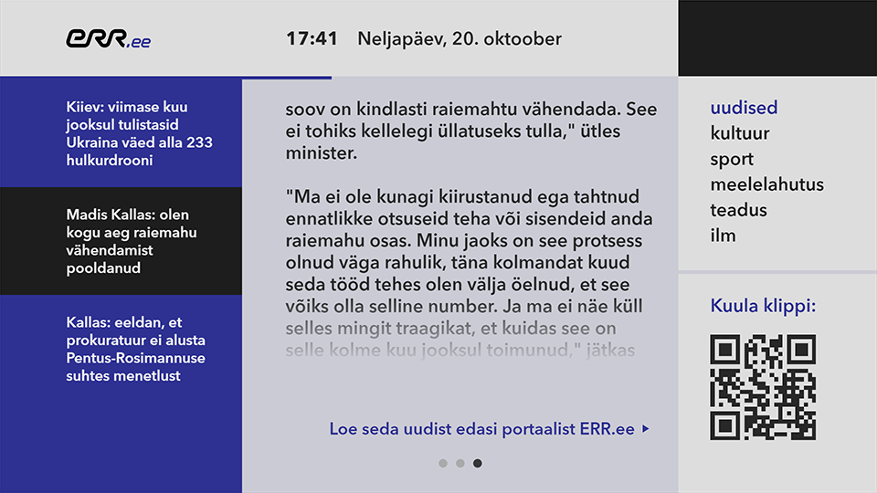

# ERR News App for Estonian Television



## Introduction

Project runs with:

- Node v14.20.0
- Angular v14.2.0
- Electron v16.0.0
- Electron Builder v22.13.1

## Getting Started

_Install dependencies with npm (used by Electron renderer process):_

```bash
npm install
```

If you want to generate Angular components with Angular-cli , you **MUST** install `@angular/cli` in npm global context.
Please follow [Angular-cli documentation](https://github.com/angular/angular-cli) if you had installed a previous version of `angular-cli`.

```bash
npm install -g @angular/cli
```

_Install NodeJS dependencies with npm (used by Electron main process):_

```bash
cd app/
npm install
```

_Install Svelte dependencies with npm (used by CasparCG template):_

```bash
cd template/
npm install
```

## To build for development

**in a terminal window** -> `npm start`

## To build for production

**in a terminal window** -> `npm run electron:build`

## Project structure

| Folder      | Description                                      |
| ------      | ------------------------------------------------ |
| app         | Electron main process folder (NodeJS)            |
| src         | Electron renderer process folder (Web / Angular) |
| template    | CasparCG template graphics folder (Web / Svelte) |
